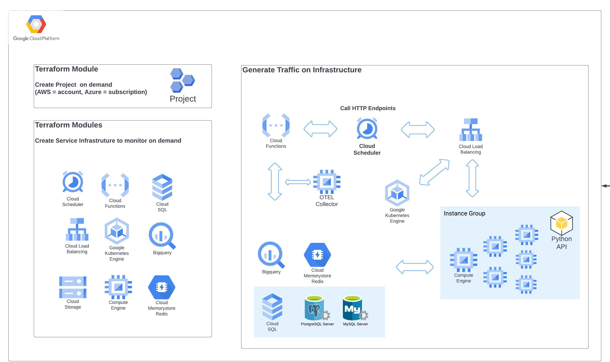

# What is this
Contents of this folder have terraform and other code needed to deploy sample infrastructure for all of the services in GCP.

# How to deploy sample infrastructure

main.tf file in this directory contains modules to deploy infrastructure

It is designed to be read from top to bottom and you can comment out everything and deploy modules one at a time working from top to bottom.

Modules and their dependencies should be self explanatory.

If you comment out modules in main.tf look at correspondiong values in output.tf

The collection folder contains terraform to deploy collection resources to GCP using either local path or remote registry.

Code assumes you have a project set up with proper permissions

# Deploying sock-shop on GKE instance
Current code is here - https://github.com/observeinc/content-eng-sock-shop-temp/tree/main/sockshop

Sock-shop deployment with OTEL instrumentation is under development and will change but there should be a link to deployable versions here

